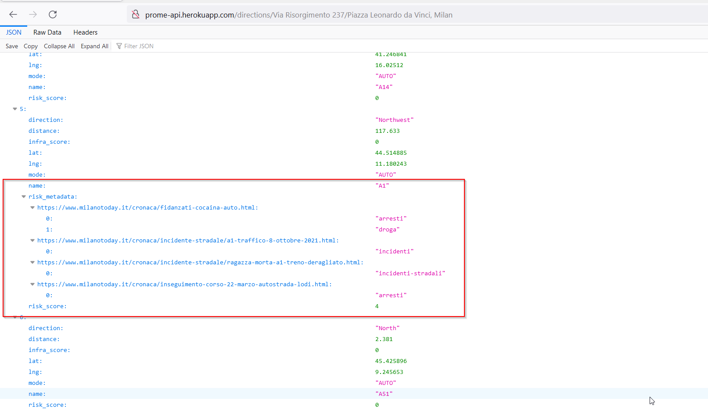
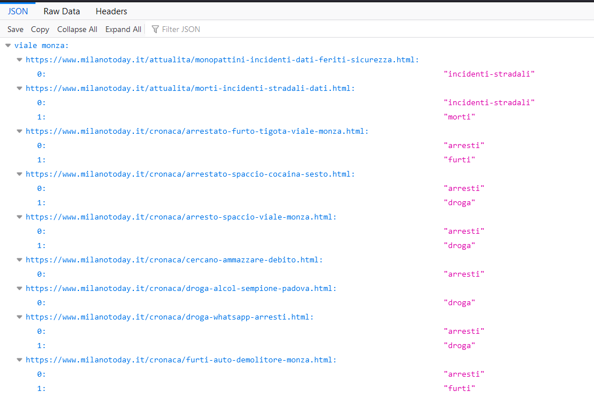

# ProMe

API Prototype for ProMe app
- Uses `https://developer.mapquest.com/` for maps
- Other values provided in [config file](config.py)

**Start with server.py**

## Description

### Get route from source to destination with risk score for each street
Calling `https://prome-api.herokuapp.com/directions/<from>/<to>` returns the route from the source (from) to destination (to), as a list of streets

For each street, following values will be returned:
- name: Name of street
- distance: Distance to travel in km
- lng: Longitude of starting point
- lat: Latitude of starting point
- direction: Direction to travel along
- mode: Mode of transport (AUTO, WALKING, BICYCLE)
- risk_score: Score calculated for risk based on news articles for the street
- risk_metadata: All news articles and the tags that were associate with them based on new sources
- infra_score: Score calculated for infrastructure available along the street initialized to 0

`https://pro-me.herokuapp.com/directions/pedestrian/<from>/<to>` will return the same values but mode of transport will only be considered as *WALKING*

**Example usage:** 

- To get risk score for a route: http://prome-api.herokuapp.com/directions/Via%20Risorgimento%20237/Piazza%20Leonardo%20da%20Vinci,%20Milan

### Get all news articles related to a particular street between a date range
Calling `https://pro-me.herokuapp.com/news/<street name>/<start date>/<end date>` will return all news articles between the date range in the configured sources in config.py related to the specified street

For each street, following values will be returned:
- street: Name of street
- source: Source of news
- tags: Associated tags
- link: Link for news article
- date: Date of news article
- time: Time of news article

**Example usage:** 

- To get all news for Viale Monza between two dates: http://prome-api.herokuapp.com/news/viale monza/2020-06-20/2021-10-27

## TODO
- Generated tagged dataset from news data
- Improve news article detection and scoring
- User Authentication and DB
- Add infrastructure-related data to street data
- Add more news sources